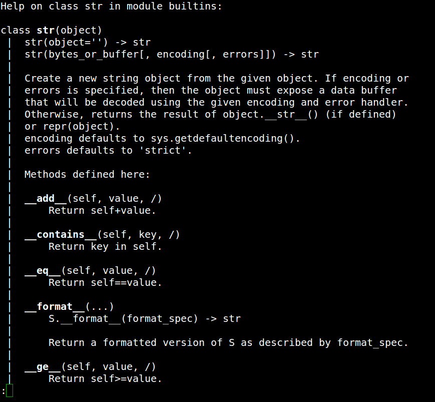

# String

A classe String é muito famosa em Python por ser muito rica em métodos e possuir uma interface muito fácil de trabalhar.

Em algumas linguagens manipular sequências de caracteres não é um trabalho muito trivial, porém, em Python esse trabalho é muito simples.

Existem alguns comandos em Python que ainda não discutimos, mas acho que agora é um excelente momento para conhece-los. Experimente abrir o interpretador Python e entrar com o comando **help(str)**, como retorno você deve ver algo assim:



O comando help exibe a documentação do objeto que passamos entre parênteses, no nosso caso ele fornece toda a documentação da classe str (string).

> O comando help pode ser usado para consultar a documentação completa da classe em modo texto. 
>
> Se você deseja apenas consultar os métodos disponíveis no objeto você pode utilizar a função **dir()**. Essa função irá retornar todos os métodos disponíveis na classe do objeto passado entre parênteses.

String é um objeto fatiável e em Python isso quer dizer que podemos acessar qualquer parte do objeto fazendo o uso de colchetes.

### Slicing de Strings

Basicamente a sintaxe de fatiamento é a seguinte: `[start: stop[, step]]`. Todos os objetos que são fatiáveis seguem essa mesma convenção para acesso de seus itens.

Vamos ver alguns exemplos de como podemos acessar os valores da string.

```python
my_name = 'Guilherme Arthur de Carvalho'

my_name[0]
>>> 'G'
my_name[:9]
>>> 'Guilherme'
my_name[10:16]
>>> 'Arthur'
my_name[::-1]
>>> 'ohlavraC ed ruhtrA emrehliuG'
my_name[10:]
>>> 'Arthur de Carvalho'
```

### Métodos úteis

Algumas operações são bem comuns de serem feitas com strings durante o desenvolvimento, para facilitar o trabalho, Python vem com muitos métodos no objeto padrão tornando simples manipular o valor contido no objeto. Vamos ver alguns métodos:

```python
my_string = 'Algum texto aqui'

my_string.upper()  # uppercase
>>> 'ALGUM TEXTO AQUI'

my_string.title()  # deixar a primeira letra em maiusculo
>>> 'Algum Texto Aqui'

my_string.lower().count('a')  # contar o número de ocorrências na string
>>> 2

','.join(my_string)
>>> 'A,l,g,u,m, ,t,e,x,t,o, ,a,q,u,i'

# Elimina os espaços em branco (esquerda, direita e ambos)
'  texto com espaço na esq'.lstrip()
>>> '  texto com espaço na esq'

' texto com espaço       '.strip()
>>> 'texto com espaço'

'Algum titulo aqui'.center(50, '-')   # centraliza o texto
>>> '----------------Algum titulo aqui-----------------'

```

Existem muitos outros métodos úteis na classe Str, abra o terminal consulte a documentação e experimente cada um para ver como funcionam. 


## Exercícios

1. Crie um programa que use pelo menos 5 métodos (que não usamos ainda) da classe str. Insira alguns comentários explicando o que cada método faz.

