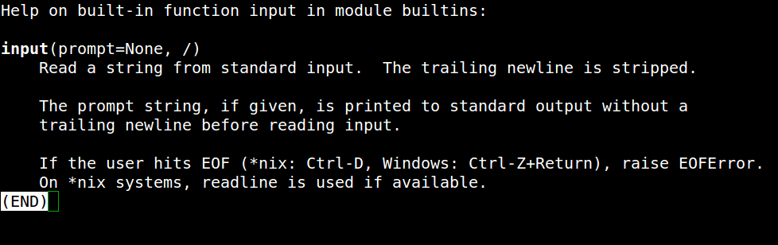

# Entrada e Saída de dados

Até o momento os dados que estamos manipulando estão definidos de maneira estática em nosso programa. Apartir de agora vamos buscar esses dados de fonte externa.

A primeira forma que vamos buscar será através da digitação do usuário e posteriormente através de arquivos.

## Input

Python nos permite interagir com o usuário através do terminal onde o programa está sendo executa. Para isso fazemos o uso da função *input*.



Como podemos ver a função pede um texto que será apresentado ao usuário, e trava o terminal aguardando que algum valor seja digitado. Quando a tecla return é pressionada o valor é retornado para quem chamou a função.

```python
input('Qual seu nome: ')
>>> Qual seu nome:

# Armazenando o valor em uma variável
name = input('Qual seu nome: ')
>>> Qual seu nome: Guilherme
  
print(name)
>>> 'Guilherme'

# Convertendo o valor de retorno
age = int(input('Quantos anos você tem: '))
>>> Quantos anos você tem: 23

print(age)
>>> 23
```

## File

Podemos ler arquivos para recuperar algumas informações para o nosso programa. É muito comum desenvolver programas que leiam arquivos XLS, e transformem os dados contidos na planilha em alguma informação pertinente no sistema, através de gráficos por exemplo.

Vamos criar um programa para ler um CSV que contém as informações de carros a venda de uma garagem de carros. Primeiramente crie uma pasta com o nome "09_entrada_saida_dados".

Dentro da pasta crie um arquivo CSV com o nome "cars.csv":

```csv
"Modelo","Marca","Ano","Cor"
"Palio","Fiat",2003,"Chumbo"
"S10","Chevrolet",2000,"Preta"
"Logan","Renault",2011,"Prata"
"F1000","Ford",1990,"Branca"
```

Agora vamos criar o código para ler os valores do arquivo e exibir para o usuário quais são os carros disponíveis. Crie um arquivo chamado "read_csv.py", com o seguinte conteúdo:

```python
import csv

with open('cars.csv') as f:
    reader = csv.reader(f)
    for row in reader:
        print(row)
```

Pronto, agora vamos entender um pouco mais sobre o nosso código. Vamos explicar por linhas:

1. Importamos o módulo que contém os métodos para trabalhar com csv.
2. Usamos o comando **with** para gerenciar a abertura/fechamento do arquivo.
3. Extraímos as linhas do csv.
4. Iteramos sobre todas as linhas contodas no arquivo.
5. Exibimos o valor da de cada linha para o usuário.

Para executar o script digite o seguinte comando:

```shell
$ python read_csv.py
['Modelo', 'Marca', 'Ano', 'Cor']
['Palio', 'Fiat', '2003', 'Chumbo']
['S10', 'Chevrolet', '2000', 'Preta']
['Logan', 'Renault', '2011', 'Prata']
['F1000', 'Ford', '1990', 'Branca']
```

Podemos melhorar um pouco a apresentação dos resultados, talvez formatar a saída como se fosse uma tabela ajudaria o usuário a ler melhor.

Para isso podemos usar os métodos da classe **str** que estudamos anteriormente. Porém esse problema é muito comum e existem algumas libs que já implementam esse comportamento para nós. Uma delas é a lib [tabulate](https://pypi.python.org/pypi/tabulate).

Para fazer a instalação da lib use o pip:

```shell
$ pip install tabulate
```

Com a lib instalada vamos alterar o nosso script para exibir o conteúdo de forma mais amigável.

```python
import csv

from tabulate import tabulate

with open('cars.csv', 'r') as f:
    reader = csv.reader(f)
    headers = None
    data = []

    for index, row in enumerate(reader):
        if index == 0:
            headers = row
        else:
            data.append(row)
    print(tabulate(data, headers, tablefmt='grid'))
```

Execute o programa:

```sh
$ python read_csv.py

+----------+-----------+-------+--------+
| Modelo   | Marca     |   Ano | Cor    |
+==========+===========+=======+========+
| Palio    | Fiat      |  2003 | Chumbo |
+----------+-----------+-------+--------+
| S10      | Chevrolet |  2000 | Preta  |
+----------+-----------+-------+--------+
| Logan    | Renault   |  2011 | Prata  |
+----------+-----------+-------+--------+
| F1000    | Ford      |  1990 | Branca |
+----------+-----------+-------+--------+
```


## Exercícios

1. Crie um programa de cadastro de gados. Ao ser executado o sistema deve mostrar o seguinte menu ao usuário:

   1. Cadastrar boi.
   2. Apagar boi.
   3. Listar bois.

   O cadastro deve conter o número de indentificação do boi, nome e peso.
   Para apagar um boi o usuário deve informar o número de identificação do boi que deseja apagar.

   Na listagem exibir todos os bois cadastrados e no final da listagem exibir as informações do boi mais leve e do boi mais pesado.

2. Crie um programa que leia o seguinte CSV e exiba em ordem crescente por preço os livros.

   ```csv
   "Title","Price"
   "Python Pocket Reference, 4th Edition","35.00"
   "Python for Unix and Linux System Administration","21.00"
   "Python and AWS Cookbook","12.35"
   "Beginning Python","10.00"
   "Programming in Python 3, 2nd Edition","19.80"
   "Foundations of Python Network Programming, 2nd Edition","11.00"
   "Python Algorithms","10.50"
   ```

    
